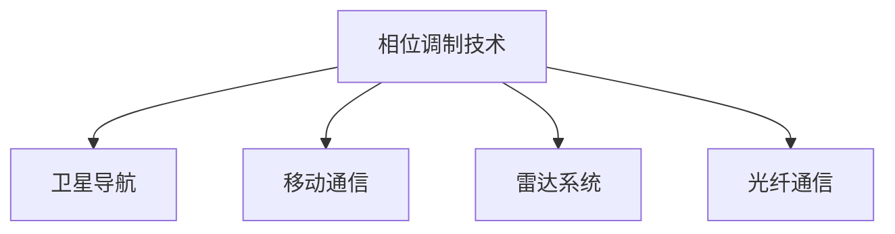

### 信号调制：相位调制原理与工程实现

#### 基本概念
**相位调制(Phase Modulation, PM)** 是将信息调制到载波信号相位上的技术，载波相位随基带信号幅度变化而变化。

**载波与副载波**：
- **载波**：高频正弦波信号
  $$c(t) = A_c \cos(2\pi f_c t + \phi_0)$$
  其中：
  - $A_c$: 载波振幅
  - $f_c$: 载波频率
  - $\phi_0$: 初始相位
- **副载波**：频率低于主载波的辅助载波，常用于复杂通信系统的双重调制

#### 相位调制原理
1. **基本相位调制**：
   $$s(t) = A_c \cos[2\pi f_c t + k_p m(t) + \phi_0]$$
   - $k_p$: 相位调制指数（单位调制信号引起的相位偏移）

2. **二进制相移键控(BPSK)**：
   $$s(t) = A_c \cos[2\pi f_c t + \pi(1-d_i)]$$
   - $d_i \in \{0,1\}$，对应0和π相位

3. **正交相移键控(QPSK)**：
   $$s(t) = A_c \cos[2\pi f_c t + (2i+1)\pi/4]$$
   - $i \in \{0,1,2,3\}$，对应四个相位状态

#### 副载波调制系统
**系统架构**：

**工作原理**：
1. 基带信号先调制到低频副载波
2. 调制后的副载波再调制到主载波
3. 实现频分复用多路传输

#### 工程实现
**模拟相位调制器**：
- **变容二极管法**：
  - 利用变容二极管电容随电压变化的特性
  - 通过LC谐振电路改变相位
- **移相网络法**：
  - 使用RC网络产生相移
  - 调制信号控制RC参数

**数字相位调制器**：
- **DDS方法**：
  1. 数字累加器生成相位增量
  2. 查表获取正弦波值
  3. 数字控制相位偏移
- **正交调制法**：
  - 分解信号为I/Q分量
  - 分别调制正交载波后合成

**GNSS实现（GPS示例）**：
- L1信号：BPSK调制C/A码
- L2信号：BPSK调制P(Y)码
- 导航电文二次调制已调载波

#### 接收机解调实现
**相干解调**：
- **锁相环(PLL)**：
  - VCO生成本地载波
  - 相位比较器跟踪相位差
- **正交解调**：
  - 接收信号与I/Q载波相乘
  - 通过基带I/Q信号计算相位

**数字解调**：
- **DSP方法**：
  1. 信号采样量化
  2. 数字混频获取基带
  3. 数字滤波降噪
- **SDR实现**：
  - FPGA/处理器实现数字解调
  - 软件算法支持多调制方案

#### 工程优化
| 优化方向        | 关键技术                        |
|-----------------|-------------------------------|
| 相位噪声抑制    | 高稳定晶振，PLL环路优化         |
| 多普勒补偿      | AFC跟踪，前向纠错码            |
| 多径效应处理    | RAKE接收机，空时编码           |

